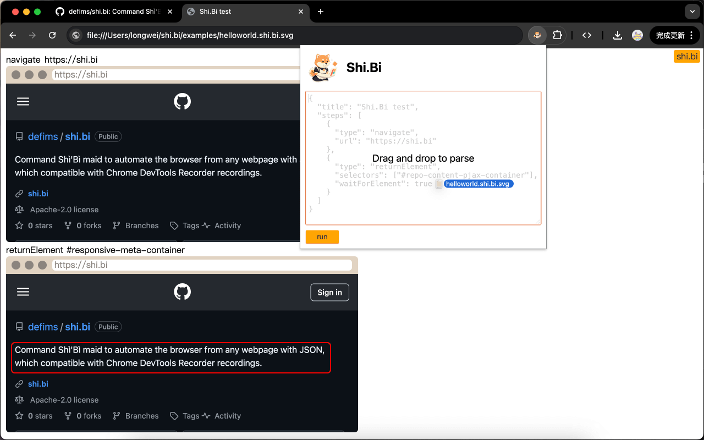
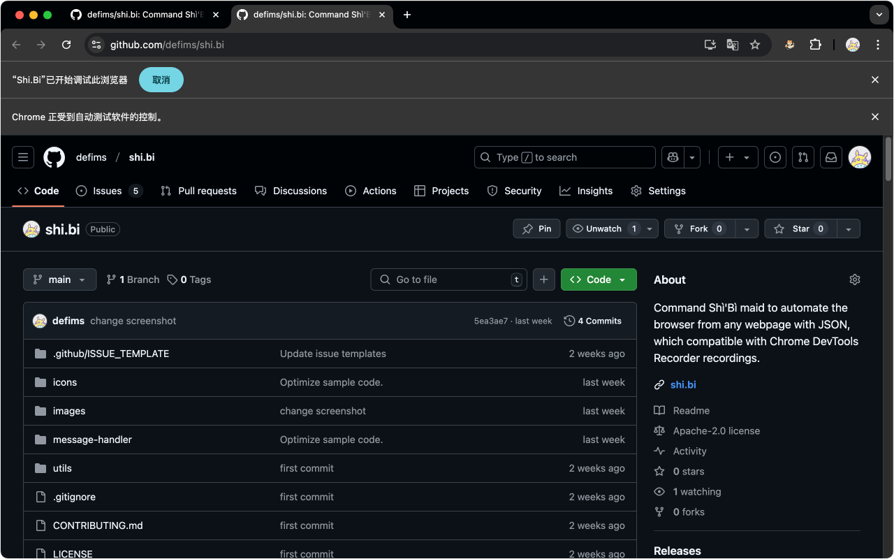

# shi.bi: Your Automated Browser Maid

shi.bi (pronounced Shì'Bì) is a powerful browser automation tool that allows you to command your browser to perform various tasks automatically using JSON instructions from any webpage. It's like having a personal maid for your browser! What's more, it's fully compatible with Chrome DevTools Recorder recordings, so you can easily record your manual actions and turn them into automation scripts.

# Features
- JSON Commands: Use clear and concise JSON to describe automation tasks, making it easy to write and extend with other services (like ChatGPT).
- Chrome DevTools Recorder Compatibility: Directly import recording files from Chrome DevTools Recorder to quickly automate tasks.
- Highly Flexible: Beyond compatibility with Chrome DevTools Recorder instructions, it introduces new commands such as ifElement, loop, break, multipleClicks, returnElement, upload, and waitTime, greatly simplifying browser automation.

# Usage
1. Install shi.bi Chrome Extension: [Shi.Bi](https://chromewebstore.google.com/detail/shibi/padmogncdghipfgnfbmidiggofeaahno)
2. Run shibi JSON using any of the following methods:
  - Open shi.bi.json or shi.bi.svg, then click the shi.bi button in the upper right corner.
  - Drag and drop shi.bi.json or shi.bi.svg into the Shi.Bi extension's popup window, and then click the Run button to run the Parsed shibi JSON.
  - Directly enter shibi JSON in the Shi.Bi extension's popup window and click the Run button.
  - Send commands from any webpage or developer tools.

# Example
```javascript
console.log(
  await chrome.runtime.sendMessage(
    await (await fetch("https://shi.bi/id")).text(), // Extension ID, handwritten or obtained via https://shi.bi/id.
    {
      type: 0, // 0 for run Shi.Bi json
      payload: { // Shi.Bi json content
        title: 'Shi.Bi test',
        steps: [
          {
            type: "navigate",
            url: "https://shi.bi"
          },
          {
            type: "returnElement",
            selectors: ["#responsive-meta-container"],
            waitForElement: true,
          }
        ]
      }
    }
  )
)
```





# Step Type
Shi.Bi extended the step based on [@puppeteer/replay](https://github.com/puppeteer/replay).
## [Change](https://github.com/puppeteer/replay/blob/main/docs/api/interfaces/Schema.ChangeStep.md)
Changes out the input identified by the locator using the provided value. The type of the input is determined at runtime and the appropriate fill-out method is chosen based on the type. contenteditable, select, textarea and input elements are supported.
"type", "selectors" and "value" are required fields, while others are optional.
```json
{
  "title": "",
  "type": "change",
  "waitForElement": false,
  "selectors": [],
  "value": "",
  "timeout": 1000,
  "assertedEvents": []
}
```
## [Click](https://github.com/puppeteer/replay/blob/main/docs/api/interfaces/Schema.ClickStep.md)
Clicks the located element.
"type", "selectors", "offsetX" and "offsetY" are required fields, while others are optional.
```json
{
  "title": "",
  "type": "click",
  "waitForElement": false,
  "selectors": [],
  "deviceType": "mouse",
  "button": "primary",
  "offsetX": 0,
  "offsetY": 0,
  "duration": 50,
  "timeout": 1000,
  "assertedEvents": []
}
```
## [Close](https://github.com/puppeteer/replay/blob/main/docs/api/interfaces/Schema.CloseStep.md)
Close the page.
"type" is required field, while others are optional.
```json
{
  "title": "",
  "type": "close",
  "timeout": 1000,
  "assertedEvents": []
}
```
## [DoubleClick](https://github.com/puppeteer/replay/blob/main/docs/api/interfaces/Schema.DoubleClickStep.md)
Double clicks the located element.
"type", "selectors", "offsetX" and "offsetY" are required fields, while others are optional.
```json
{
  "title": "",
  "type": "doubleClick",
  "waitForElement": false,
  "selectors": [],
  "deviceType": "mouse",
  "button": "primary",
  "offsetX": 0,
  "offsetY": 0,
  "duration": 50,
  "timeout": 1000,
  "assertedEvents": []
}
```
## [EmulateNetworkConditions](https://github.com/puppeteer/replay/blob/main/docs/api/interfaces/Schema.EmulateNetworkConditionsStep.md)
This does not affect WebSockets and WebRTC PeerConnections (see https://crbug.com/563644).
A list of predefined network conditions can be used by importing [PredefinedNetworkConditions](https://pptr.dev/api/puppeteer.predefinednetworkconditions).
"type", "download", "upload" and "latency" are required fields, while others are optional.
```json
{
  "title": "",
  "type": "emulateNetworkConditions",
  "download": 0,
  "upload": 0,
  "latency": 0,
  "timeout": 1000,
  "assertedEvents": []
}
```
## [Hover](https://github.com/puppeteer/replay/blob/main/docs/api/interfaces/Schema.HoverStep.md)
Hovers over the located element.
"type", and "selectors" are required fields, while others are optional.
```json
{
  "title": "",
  "type": "hover",
  "waitForElement": false,
  "selectors": [],
  "timeout": 1000,
  "assertedEvents": []
}
```
## [KeyDown](https://github.com/puppeteer/replay/blob/main/docs/api/interfaces/Schema.KeyDownStep.md)
Dispatches a keydown event.
"type", and "key" are required fields, while others are optional.
```json
{
  "title": "",
  "type": "keyDown",
  "key": "",
  "timeout": 1000,
  "assertedEvents": []
}
```
## [KeyUp](https://github.com/puppeteer/replay/blob/main/docs/api/interfaces/Schema.KeyUpStep.md)
Dispatches a keyup event.
"type", and "key" are required fields, while others are optional.
```json
{
  "title": "",
  "type": "keyUp",
  "key": "",
  "timeout": 1000,
  "assertedEvents": []
}
```
## [Navigate](https://github.com/puppeteer/replay/blob/main/docs/api/interfaces/Schema.NavigateStep.md)
Navigates the frame or page to the given url.
"type", and "url" are required fields, while others are optional.
```json
{
  "title": "",
  "type": "navigate",
  "url": "",
  "timeout": 1000,
  "assertedEvents": []
}
```
## [Scroll](https://github.com/puppeteer/replay/blob/main/docs/api/interfaces/Schema.ScrollPageStep.md)
Scrolls the located element or page.
"type" is required field, while others are optional.
```json
{
  "title": "",
  "type": "scroll",
  "waitForElement": false,
  "selectors": [],
  "x": 0,
  "y": 0,
  "timeout": 1000,
  "assertedEvents": []
}
```
## [SetViewport](https://github.com/puppeteer/replay/blob/main/docs/api/interfaces/Schema.SetViewportStep.md)
setViewport will resize the page. A lot of websites don't expect phones to change size, so you should set the viewport before navigating to the page.
In the case of multiple pages in a single browser, each page can have its own viewport size. Setting the viewport to null resets the viewport to its default value.
"type", "width", "height", "deviceScaleFactor", "isMobile", "hasTouch" and "isLandscape" are required fields, while others are optional.
```json
{
  "title": "",
  "type": "setViewport",
  "width": 0,
  "height": 0,
  "deviceScaleFactor": 0,
  "isMobile": false,
  "hasTouch": false,
  "isLandscape": false,
  "timeout": 1000,
  "assertedEvents": []
}
```
## [WaitForElement](https://github.com/puppeteer/replay/blob/main/docs/api/interfaces/Schema.WaitForElementStep.md)
Wait for the selector to appear in page. If at the moment of calling the method the selector already exists, the method will return immediately. If the selector doesn't appear after the timeout milliseconds of waiting, the function will throw.
"type", and "selectors" are required fields, while others are optional.
```json
{
  "title": "",
  "type": "waitForElement",
  "selectors": [],
  "operator": "==",
  "count": 1,
  "visible": true,
  "properties": {},
  "attributes": {},
  "timeout": 1000,
  "assertedEvents": []
}
```
## [WaitForExpression](https://github.com/puppeteer/replay/blob/main/docs/api/interfaces/Schema.WaitForExpressionStep.md) (Not recommended for use)
Waits for the provided expression, to return a truthy value when evaluated in the page's context.
"type", and "expression" are required fields, while others are optional.
```json
{
  "title": "",
  "type": "waitForExpression",
  "expression": "",
  "timeout": 1000,
  "assertedEvents": []
}
```
## [CustomStep](https://github.com/puppeteer/replay/blob/main/docs/api/interfaces/Schema.CustomStepParams.md)
Usually the outermost step, equivalent to a module.
"type" and "name" are required fields, while others are optional.
```json
{
  "title": "",
  "type": "customStep",
  "name": "",
  "parameters": {},
  "timeout": 1000
}
```
## Flow
shibi JSON module.
"steps" is required fields, while others are optional.
```json
{
  "title": "",
  "type": "flow",
  "steps": [],
  "timeout": 1000
}
```
## Break
An interrupt for the current steps, commonly used within the steps of a loop step.
"type" is required field, while others are optional.
```json
{
  "title": "",
  "type": "break",
  "timeout": 1000,
  "assertedEvents": []
}
```
## IfElement
Executes steps based on the selector conditions, otherwise executes elseSteps.
"type" and "selectors" are required fields, while others are optional.
```json
{
  "title": "",
  "type": "ifElement",
  "waitForElement": false,
  "selectors": ["#id .class tag"],
  "operator": ">=",
  "count": 1,
  "visible": true,
  "properties": {},
  "attributes": {},
  "steps": [],
  "elseSteps": [],
  "timeout": 1000,
  "assertedEvents": []
}
```
## Loop
This function is designed to execute a sequence of steps multiple times. The 'type' parameter is mandatory, while others are optional. The 'count' parameter, if not specified, defaults to -1, meaning the steps will be executed indefinitely.
"type" and "selectors" are required fields, while others are optional.
```json
{
  "title": "",
  "type": "loop",
  "count": -1,
  "steps": [],
  "timeout": 1000,
  "assertedEvents": []
}
```
## MultipleClicks
Similar to doubleClick and click, it allows for multiple clicks.
"type", "selectors", "offsetX" and "offsetY" are required fields, while others are optional.
```json
{
  "title": "",
  "type": "multipleClicks",
  "waitForElement": false,
  "selectors": [],
  "count": 1,
  "deviceType": "mouse",
  "button": "primary",
  "offsetX": 0,
  "offsetY": 10,
  "duration": 50,
  "timeout": 1000,
  "assertedEvents": []
}
```
## ReturnElement
Used to obtain the outerHTML of a certain element.
"type" and "selectors" are required fields, while others are optional.
```json
{
  "title": "",
  "type": "returnElement",
  "waitForElement": false,
  "selectors": [],
  "operator": ">=",
  "count": 1,
  "visible": true,
  "properties": {},
  "attributes": {},
  "timeout": 1000,
  "assertedEvents": []
}
```
## UploadFile
Used to upload files to a destination page. Shi.Bi will automatically handle cross-origin conversion for blob URLs.
"type", "selectors", "fileName", and "fileUrl" are required fields, while others are optional.
```json
{
  "title": "",
  "type": "uploadFile",
  "waitForElement": false,
  "selectors": [],
  "fileType": "",
  "fileName": "",
  "fileUrl": "",
  "timeout": 1000,
  "assertedEvents": []
}
```
## WaitTime
Used to delaying the execution of subsequent steps.
"type" and "duration" are required fields, while others are optional.
```json
{
  "title": "",
  "type": "waitTime",
  "duration": 0,
  "assertedEvents": []
}
```
## Input
The input step is syntactic sugar for a sequence of keyDown and keyUp steps. It will convert the value of the text field into a corresponding number of keyDown and keyUp steps. type and text are required fields, while others are optional. Unlike ChangeStep, Input is broken down into KeyDown and KeyUp events, instead of directly changing the input field's value. This ensures that places that only monitor KeyDown and KeyUp events are also triggered.
"type" and "text" are required fields, while others are optional.
```json
{
  "title": "",
  "type": "input",
  "text": "text",
  "timeout": 1000,
  "assertedEvents": []
}
```

# ShiBi JSON Gramma
All code in a Shi.Bi json is grouped into steps, which have the following pseudocode structure.
<!--

-->

# Break Change
- In version 1.0.2, the comment field from version 1.0.1 has been changed to the title field. Additionally, the upload step in version 1.0.1 has been renamed to the uploadFile step in version 1.0.2.

# Contributing
Contributions are welcome! Please refer to the CONTRIBUTING.md file for more information.

# License
This project is licensed under the Apache 2.0 License.
